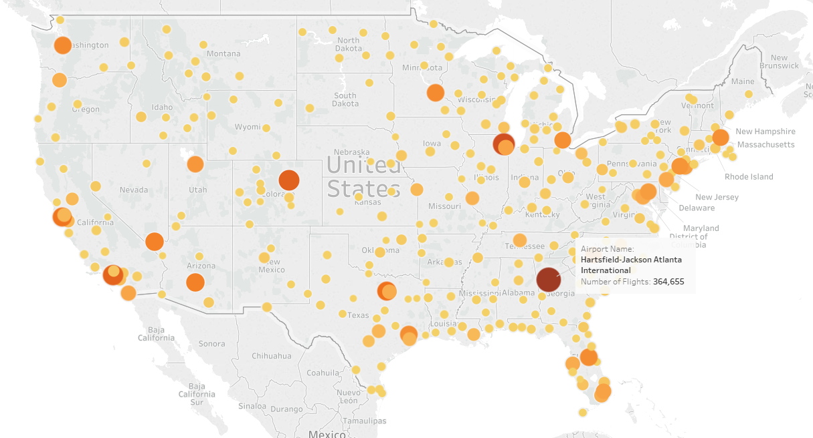

# Visualising Flight Data with Tableau

[Link to visualisation](https://public.tableau.com/views/FlightData_28/FlightDelays?:embed=y&:display_count=yes)

### Summary

Bureau of Transportation Statistics has many datasets. The one used in 
this visualisation has information of over 5 million flights in US 
from 2017.
The Visualisation story follows Average Departure and Arrival delays and
tries to understand the hidden causes for these delays.

Definitions for common terms: 
 **Carrier Delay**: Cause of delay was within airline's control.  
 **Late Aircraft Delay**: Cause of delay was a previous delayed flight.
  
 **NAS Delay**: Cause of delay was within's NAtional Airspace System's 
 control. 
 **Security Delay**: Cause of delay was a security breach or long lines 
 at screening. 
 **Weather delay**: Cause of delay were unfavourable weather conditions.

### Design

The story follows a simple flow. The reader has minimal interaction with
the data itself. I chose the limitation because the data is vast, 
and I did not want any viewers to get lost in the sea of information.

That being said, the first tab contains a map of all airports visualised
by number of flights the had in 2017. At the beggining, I chose to 
encode with size of the datapoints. Though this made airports with very 
low traffic invisible. Encoding the data with colour was also not very 
great. So I decided to convey it through size and colour. This made the 
busiest airports stand-out, while also not hiding the smaller ones.

<table>
<tr>
<th>Version 1</th>
<th>Version 2</th>
<th>Final</th>
</tr>
<tr>
<td> </td>
<td> </td>
<td></td>
</tr>
<table>

Next, I was going to add a chart which displayed delay by airport split 
by cause of the delay. I did not use it in the final version, as I felt 
it was redundant information, and unnecessaarily complicated.

<table>
<caption>Complicated charts</caption>
<tr>
<td> </td>
<td> </td>
</tr>
<table>

### Feedback

Hi! I really liked your story and the analysis (made me rethink some of 
mine). Looking at the charts - I would suggest to change color of the 
bars on the Delay by Airport. Shouldn't all negative values be green?

> I did consider that. But that took emphasis away from the minimum 
> value. Negative values in the chart stand-out by themselves. Colour 
> was added to the bar to make maximum and minimum value more apparent.

Have you mentioned the source of the data? As to relationship, I 
understand that it's really difficult for various airlines to sustain 
using time frames. An airline could lose or gain business based on the 
number of minutes it can salvage through it's service. Obviously also 
based on exterior conditions such as the weather. Oh ans also the number 
cancelled flights is shocking. I understand everything in the graphic it
is pretty clear, and well projected

> I have added links to the data source in the the second tab of the 
> story.

There are hundreds of airports in this dataset, many of which are quite small 
and out-of-the-way. In your charts, on the airports with the highest and 
lowest average delays, you include at least one of these airports, Falls 
International Einarson Field. This is basically just an airstrip. Some of the 
other airport in that chart are larger but likewise regional and small. I 
would recommend filtering out airports that fall below a certain flight volume 
threshold.

> I hadn't considered that. Upon further investigation, I found that most of the
> airports in that chart were reqional fields with a single flight. To avoid 
> them, I set a filter so only airports with at least 5000 flights show up.

### Resources

[Tableau community forums](https://community.tableau.com/community/forums) 
[Bureau of Transportation Statistics](https://www.transtats.bts.gov/Tables.asp?DB_ID=120&DB_Name=Airline%20On-Time%20Performance%20Data&DB_Short_Name=On-Time)

#### Data Sources
Raw Data: [Link](https://drive.google.com/drive/folders/1rv_D3251_flGKsr-7ETVTUnKv4Gcls-Q?usp=sharing) 
Cleaned Data: [Link](https://drive.google.com/file/d/1v5WA3GKk2HOQc1F6Nfvr0Ori_8G-y8Of/view?usp=sharing)
